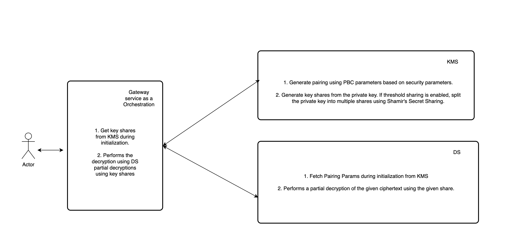
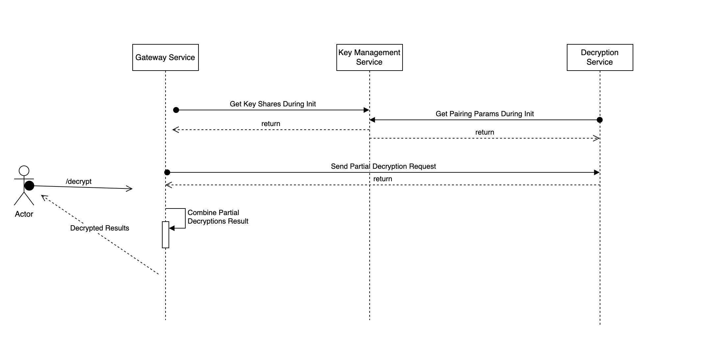

# Explore
A simple microservice architecture using Go for a threshold decryption service. 

## Services

- **Key Management Service**: Responsible for generating the key pair, splitting the private key into shares, and distributing these shares.
- **Threshold Decryption Service**: Performs partial decryption using the shares.
- **Gateway Service**: Acts as the entry point for clients, coordinating the requests to the KMS and Decryption services.

### Responsibilities of the Services

| Service             | Responsibilities                                                                                                                                                                          |
|---------------------|-------------------------------------------------------------------------------------------------------------------------------------------------------------------------------------------|
| Key Management Service (KMS) | - Generate a key pair (public and private key).<br> - Split the private key into shares using Shamir's Secret Sharing.<br> - Provide endpoints to retrieve the public key and the shares. |
| Decryption Service  | - Perform partial decryption using the shares received from the KMS.<br> - Provide endpoints to handle decryption requests.                                                               |
| Gateway Service     | - Coordinate between clients and the other services.<br> - Aggregate the partial decryptions to produce the final results.<br> - Act as the entry point for clients.                      |


# Getting Started
## Installation and Running the Services

**Go to the project root where docker yml file and run **:
   ```sh
   docker-compose down
   docker-compose up --build

   ```
** Success Scenario: When Docker builds and starts up successfully, you should see logs similar to:**
   ```sh
   explore-key-management-service-1          | 2024/05/27 22:01:19 INFO di container is starting up
   explore-key-management-service-1          | 2024/05/27 22:01:19 INFO http server is started successfully addr=0.0.0.0:9001
   explore-threshold-decryption-service-1    | 2024/05/27 22:01:19 INFO di container is starting up
   explore-threshold-decryption-service-1    | 2024/05/27 22:01:19 INFO http server is started successfully addr=0.0.0.0:9002
   explore-gateway-service-1                 | 2024/05/27 22:01:19 INFO di container is starting up
   explore-gateway-service-1                 | 2024/05/27 22:01:19 INFO http server is started successfully addr=0.0.0.0:9000
   ```
** Run this script to test **:
   ```sh
#!/bin/bash

# Function to install jq if not already installed
install_jq() {
    echo "jq could not be found, installing jq..."
    if [[ "$OSTYPE" == "linux-gnu"* ]]; then
        if command -v apt-get &> /dev/null; then
            sudo apt-get install -y jq
        elif command -v yum &> /dev/null; then
            sudo yum install -y jq
        else
            echo "Package manager not supported. Please install jq manually."
            exit 1
        fi
    elif [[ "$OSTYPE" == "darwin"* ]]; then
        brew install jq
    else
        echo "OS not supported. Please install jq manually."
        exit 1
    fi
}

# Install jq if not already installed
if ! command -v jq &> /dev/null; then
    install_jq
fi

# Step 1: Call the ciphertext endpoint and save the response to response.json
curl -X GET http://localhost:9000/ds/ciphertext -H "Content-Type: application/json" -o response.json

# Step 2: Extract the ciphertext value from the response.json file
ciphertext=$(jq -r '.ciphertext' response.json)

# Print the ciphertext value
echo "Retrieved ciphertext: $ciphertext"

# Step 3: Prepare the JSON payload
payload=$(jq -n --arg ct "$ciphertext" '{"ciphertext": $ct}')

# Print the JSON payload for debugging
echo "JSON payload to send to decrypt endpoint: $payload"

# Step 4: Call the decrypt endpoint with the extracted ciphertext
response=$(curl -X POST http://localhost:9000/ds/decrypt -H "Content-Type: application/json" -d "$payload")

# Print the response from the decrypt endpoint
echo "Response from decrypt endpoint: $response"

   ```
**Test Results should look like something like below**:
   ```sh
  Retrieved ciphertext: ACoUVukUvE8JWb23ZbpIjYRRjmMy88YdlIEDqvMVRN5gadh3lqz4cHy8M0M8v0Jo+mtyj/sqPbivO3rphxxzyXkBG7UJ3GDkoL4vmxG8rUxvWiZU89iwESWY+B+XIoEko8SEbSxDJeXJJqZ3rGX/Z+uO4S/Gb001rBD1ci+UOvN3EQ==
JSON payload to send to decrypt endpoint: {
  "ciphertext": "ACoUVukUvE8JWb23ZbpIjYRRjmMy88YdlIEDqvMVRN5gadh3lqz4cHy8M0M8v0Jo+mtyj/sqPbivO3rphxxzyXkBG7UJ3GDkoL4vmxG8rUxvWiZU89iwESWY+B+XIoEko8SEbSxDJeXJJqZ3rGX/Z+uO4S/Gb001rBD1ci+UOvN3EQ=="
}
Response from decrypt endpoint: {"decrypted_message":"decrypted message goes here"}
   ```

## Architecture
### High-Level Architecture



### Sequence Diagram


## Techniques
### Cryptographic Techniques

- **Pairing-Based Cryptography (PBC)**: Chosen for its strong security and ability to support advanced cryptographic schemes like Identity-Based Encryption (IBE).
- **Shamir's Secret Sharing**: Ideal for distributing trust and ensuring fault tolerance by splitting a secret into multiple parts, requiring a threshold to reconstruct it. This ensures robust key management and enhances overall security.

### Orchestration

- **Gateway as Orchestration**: The Gateway was chosen for orchestration to efficiently combine partial decryption results.

## Known Bugs and Limitations

1. **Securely Connect to the Service**: No HTTPS implementation.
2. **Robust Error Handling**: Limited error handling and logging.
3. **Request ID for Distributed Log**: No mechanism for tracking individual requests.
4. **Asynchronous Threshold Decryption**: Current process is synchronous.

## Further Improvements

1. Implement HTTPS for secure communication, think of HTTP/2 such as gRPC, protocol buffers for service to service communication. 
2. Enhance error handling and logging.
3. Introduce request IDs for better traceability.
4. Refactor for asynchronous processing.
5. Implement load balancing and support for multiple nodes.
6. Add robust security measures and improved logging and monitoring.


